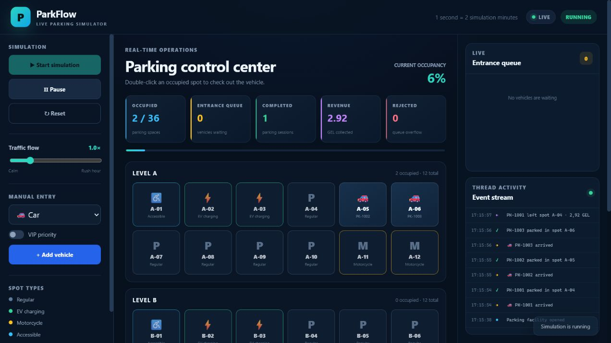

# ParkFlow Live Demo

ParkFlow Live Demo is the browser edition of the JavaFX desktop project. It is
a real-time, multi-threaded parking simulator built with Java 21 and Spring
Boot 4.1. The desktop application remains a separate project.

**[Open the live demo](https://parkflow-live-demo.onrender.com)**



## Live-demo features

- responsive English dashboard that runs in any modern browser;
- 3 parking levels and 36 type-aware parking spots;
- cars, EVs, motorcycles, and accessible vehicles;
- VIP priority and a bounded entrance queue;
- live occupancy, revenue, rejection, and completion metrics;
- start, pause, reset, speed, and manual-entry controls;
- manual check-out by double-clicking an occupied spot;
- real-time event stream using Server-Sent Events;
- parking history and receipt data;
- an isolated simulation session for every browser visitor;
- health endpoint, Docker image, Render Blueprint, and GitHub Actions CI.

## Architecture

```text
Browser (HTML/CSS/JavaScript)
           │ REST + SSE
           ▼
Spring Boot API / embedded Tomcat
           │
           ▼
Thread-safe simulation core
ExecutorService · ScheduledExecutorService
LinkedBlockingDeque · ReentrantLock · Condition
```

The simulation core is based on the desktop version, while the JavaFX layer is
replaced by a web API and responsive frontend.

## Run locally

Requirements: JDK 21 and Maven 3.6.3+.

```bash
mvn spring-boot:run
```

Then open [http://localhost:8080](http://localhost:8080).

On Windows, double-click `run-web.bat`. In IntelliJ IDEA, open `pom.xml` and
run `ParkFlowWebApplication`.

## Tests

```bash
mvn clean verify
```

The test suite covers queue overflow, spot compatibility, pricing, timed
departures, the web dashboard, and simulation API.

## Docker

```bash
docker build -t parkflow-live-demo .
docker run --rm -p 8080:8080 parkflow-live-demo
```

## Publish on Render

1. Push this folder to a public GitHub repository.
2. In Render, select **New → Blueprint**.
3. Connect the repository containing `render.yaml`.
4. Confirm the free web service.

Render builds the Docker image and provides a public `onrender.com` URL.
Free services can sleep after periods of inactivity, so the first request may
take longer while the demo wakes up.

## API

| Method | Endpoint | Purpose |
|---|---|---|
| `GET` | `/api/state` | Current dashboard state |
| `GET` | `/api/stream` | Server-Sent Events stream |
| `POST` | `/api/simulation/start` | Start or resume |
| `POST` | `/api/simulation/pause` | Pause |
| `POST` | `/api/simulation/reset` | Reset |
| `POST` | `/api/simulation/speed` | Set flow speed |
| `POST` | `/api/vehicles` | Add a vehicle |
| `POST` | `/api/spots/{id}/release` | Manual check-out |
| `GET` | `/api/history` | Completed sessions |

## Technology

Java 21 · Spring Boot 4.1 · REST · SSE · Maven · JUnit · HTML · CSS ·
JavaScript · Docker · GitHub Actions
